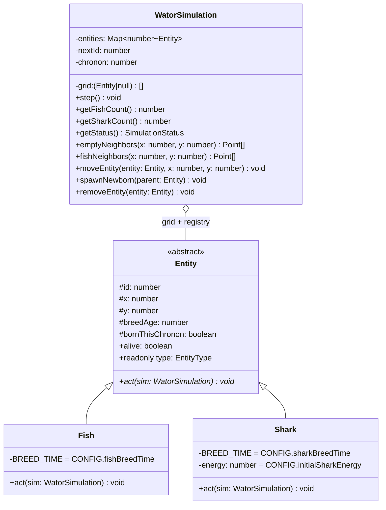

## Context

This is a greenfield implementation of the Wa-Tor simulation specified in `prd-v001.md` (see proposal.md — Why). Constraints that shape the design: Phaser 4.x loads from a CDN script tag (not bundled), TypeScript source compiles to static ES2020 output deployable from a GitHub Pages subpath, and the simulation engine must be framework-independent. Exploration decisions already settled: Vite is the build tool, speed values denote chronons per second directly (`10x` = 10 chronons/sec), entities are classes extending a common `Entity` base, and subclasses bind breeding thresholds and shark energy constants from shared config.

## Goals / Non-Goals

**Goals:**
- A correct chronon engine whose rules can be verified independently of any rendering.
- Clean separation: engine (pure logic) / scenes (Phaser lifecycle) / UI helpers (drawing widgets).
- Layout math that adapts to grid-dimension constant changes and window resizes without UI rewrites.
- Static output that works from any subpath.

**Non-Goals:**
- Deterministic/seeded randomness; catch-up compensation for throttled tabs; DOM overlays; sprites or animation (all excluded by the PRD).
- Unit test infrastructure beyond what Vitest setup naturally accompanies the Vite toolchain — tests are not a v1 deliverable but the engine design keeps them possible.

## Decisions

### D1. Layered architecture with a framework-free engine core

```
┌────────────────────────────────────────────────────┐
│ main.ts — Phaser.Game config, scene registration   │
└──────────┬─────────────────────────┬───────────────┘
           ▼                         ▼
   ┌──────────────┐        ┌─────────────────────┐
   │  BootScene   │        │  SimulationScene    │
   │ (prep, launch│        │ update loop, input, │
   │  Simulation) │        │ layout, orchestration│
   └──────────────┘        └──┬──────────┬───────┘
                              │          │
              ┌───────────────▼──┐   ┌───▼──────────────────┐
              │ WatorSimulation  │   │ src/ui/ helpers      │
              │ Entity/Fish/Shark│   │ StatsPanel, Controls,│
              │ pure logic       │   │ HistoryChart, buttons│
              └──────────────────┘   └──────────────────────┘
```

The engine never imports Phaser; scenes never implement rules. Alternative considered: putting rules in `SimulationScene` — rejected because it makes correctness untestable outside a browser and couples model constants to scene lifecycle.

### D2. Class model for entities



Rationale:
- **Polymorphic `act(sim)`** replaces type-switches in the chronon loop; the loop reads `entity.act(this)` after liveness checks.
- **Entities decide *what*, simulation owns *where***: `Fish.act`/`Shark.act` query neighbors via simulation primitives (`emptyNeighbors`, `fishNeighbors`) and request mutations (`moveEntity`, `spawnNewborn`, `removeEntity`). Grid array, ID assignment, and entity registry stay centralized in `WatorSimulation`, satisfying the state-model requirement (flat grid array + entity records).
- **Config binding in subclasses**: `Fish.BREED_TIME`, `Shark.BREED_TIME`, and `Shark.energy` initialization read `src/config.ts` constants at class definition/construction. Keeps `act()` signatures clean while preserving a single configuration source. Alternative considered — passing config into `act()` — rejected as parameter noise for an app with exactly one config source.
- **Readonly `type` discriminator** on `Entity` for stats counting and render color lookup without `instanceof` chains.
- **Deliberately shallow abstraction**: fish and shark `act()` flows diverge early (energy decrement/death/eat vs simple move), so no Template Method is forced on top; only small duplicated-looking helpers may be shared. Over-abstraction is where Wa-Tor ordering bugs hide.

### D3. Chronon algorithm

1. Snapshot living entity IDs → Fisher–Yates shuffle.
2. For each ID in order: resolve entity from registry; skip if missing, `!alive`, or `bornThisChronon`.
3. Call `entity.act(this)`.
4. After all acts: clear `bornThisChronon` flags, increment chronon counter, record population history sample, evaluate extinction status.

Ordering guarantees encoded here: shark energy decrements inside `Shark.act` before movement/eating; starvation death removes the shark before it moves; eaten fish are marked dead immediately so their shuffled turn skips them.

### D4. Speed = accumulator of chronons per second

Speed values map directly to chronons/sec (1, 5, 10, 30, 60). `SimulationScene.update(delta)` accumulates elapsed seconds and executes whole `simulation.step()` calls when the accumulator crosses 1:

```
accumulator += delta / 1000
while (accumulator >= 1 && !terminal) { simulation.step(); accumulator -= 1 }
```

At 60x on a 60 Hz display this converges to one step per frame; on 120 Hz, one per two frames. No catch-up logic (per PRD). Alternative considered — Phaser timers per speed — rejected as less precise under frame jitter.

### D5. Rendering: single Graphics redraw per frame

One `Phaser.GameObjects.Graphics` for the world; each render pass clears and batch-draws `fillCircle` per living entity (~2,500 max creatures — well within budget), plus separate Graphics objects for stats text, controls, and chart. Cell size derives from available area ÷ grid dimensions, so changing grid constants rescales automatically. Chart auto-scales its y-axis to the rolling window's maximum population (rounded up to a nice value) so both booms and crashes stay legible; axis has no labels per PRD.

### D6. Layout regions computed in one place

A layout function maps window size → rectangles for stats panel, world viewport, control column, and chart strip. Wide windows use left/center/right/bottom; narrow (below ~744 CSS px width) stacks controls below the world. The world rect preserves grid aspect ratio via letterboxing. Resize events recompute layout without touching simulation state.

### D7. Phaser as CDN global, types-only devDependency

`index.html` includes the CDN `<script>` before the module bundle; source references the global via a local ambient declaration. `phaser` is installed only as a devDependency for TypeScript types; `vite.config.ts` uses relative `base: './'` so output deploys from `/wator/ox_alpha/` or anywhere. Alternative considered — bundling Phaser — rejected: PRD mandates the CDN script tag.

### D8. PWA: cache-first app shell, network-dependent Phaser

Service worker precaches same-origin build output (HTML, JS, manifest, icons) with a cache-first strategy; CDN Phaser is not cached by us, so first load/offline behavior depends on the network unless the browser HTTP-caches it (accepted per PRD). Icons are simple SVG-derived PNGs (192px, 512px) drawing blue and green circles on water-blue background.

## Risks / Trade-offs

- [CDN Phaser unavailable offline] → Accepted per PRD; service worker covers same-origin assets only, error path simply shows nothing new rather than breaking cached shell.
- [`Math.random()` prevents reproducible runs] → Accepted per PRD; RNG isolated behind a small internal helper so a seeded variant could be added later without rule changes.
- [Graphics full redraw each frame could strain low-end devices at high populations] → Population ceiling ~2,500 circles is modest; if needed, redraw only on chronon change rather than every frame (render-on-step optimization is localized to one method).
- [Phaser-native buttons need custom hit/hover/disabled states] → Confined to a small `ui/` button helper used by both control groups; visual polish is explicitly unspecified (PRD Known Gaps).
- [Chart auto-scaling can make successive frames visually jumpy] → Round the axis maximum up coarsely (nice numbers) so it changes rarely.
